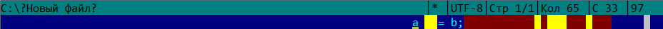

# far-extensions
Мои плагины для Far Manager.

Случай, когда в строке нет непробельных символов. Все пробелы выделяются красным, табы --- жёлтым.
Так понятно, что строка не пустая, заметна её длина, видно, где табы. Плагин "IndentationChecker"
здесь не участвует.

Случаи, когда на строке есть пробельные символы. "IdentationChecker" проверяет отступы ---
начинающие строку пробельные символы в случае, когда в ней есть и непробельные (иначе отступов нет,
вся строка состоит из пробельных символов или пуста). "TabColorer" подсвечивает табы, не являющиеся
отступами. "TrlgSpcClrr" подсвечивает красным завершающие строку пробельные символы, при этом
приоритет его раскраски меньше приоритета раскраски "TabColorer".

"GdStrpDrwr" можно воспринимать отдельно от всех остальных плагинов: он рисует полосу, помогающую
соблюдать ограничение на длину строки. Приоритет его раскраски самый маленький (среди приоритетов
раскрасок других представленных здесь плагинов), она "перекрывается" при необходимости. Это
позволяет другим плагинам исполнять их функции, при этом польза от плагина не страдает: в поле
зрения почти всегда будет какая-то строка, в которой другими плагинами не раскрашена та позиция,
которую красит "GdStrpDrwr". Скорее всего, таких строк будет достаточно много, потому что за полосу
пользователь будет стараться не заходить.

Плагины в порядке убывания приоритета их раскраски: "TabColorer", "TrlgSpcClrr",
"IndentationChecker", "GdStrpDrwrr".

"__TabColorer__" подсвечивает (раскрашивает фон) все табы, не являющиеся отступами (начинающими
строку пробельными символами (табами и пробелами) в случае, когда в строке есть и непробельные
символы, иначе их нет). Помогает отличать в коде пробелы от табов, в том числе среди завершающих
строку пробельных символов. При этом не мешает подсвечиванием отступов. Нужно различать табы и
пробелы, выделяет табы, потому что на пустом месте не закончившейся строки обычно, как мне кажется,
предполагается пробел.

"__TrlgSpcClrr__" подсвечивает завершающие строку пробельные символы. Их легко незаметить (сужу по
своему опыту) и пропустить в репозиторий или оставить в исходных файлах, которые будут
распространяться дальше.

"__IndentationChecker__" проверяет однородность отступов. Если среди отступов есть и табы, и
пробелы, подсвечивает табы.

"__GdStrpDrwrr__" рисует полосу, помогающую соблюдать ограничение на длину строки. Обычно в исходных
файлах стараются не оставлять неоправданно длинных строк. Можно задать ограничение и с помощью такой
полосы замечать превышения допустимой длины при работе с кодом. Такое уже есть в текстовых
редакторах и IDE. В Far Manager я этого не нашел, хотя возможно, где-то есть.
