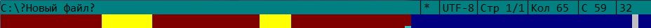
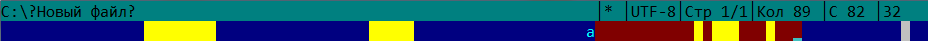
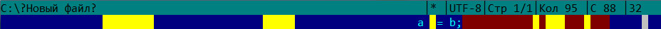

# far-extensions
Мои плагины для Far Manager.

Плагины в порядке убывания приоритета их раскраски: "TabColorer", "TrlgSpcClrr", "IndentChecker",
"GdStrpDrwrr".

"__TabColorer__" подсвечивает все табы, не входящие вгруппу начинающих строку пробельных символов.
Помогает отличать в коде пробелы от табов, в том числе среди завершающих строку пробельных символов.
При этом не мешает подсвечиванием отступов.

"__TrlgSpcClrr__" подсвечивает (раскрашивает фон) завершающие строку пробельные символы (табы и
пробелы). Их легко незаметить (сужу по своему опыту) и пропустить в репозиторий или оставить в
исходных файлах, которые будут распространяться дальше.

"__IndentChecker__" проверяет однородность отступов. Он выделяет группу начинающих строку подряд
идущих пробельных символов (табов и пробелов); если в ней есть и табы, и пробелы, подсвечивает табы.

"__GdStrpDrwrr__" рисует полосу, помогающую соблюдать ограничение на длину строки. Обычно в исходных
файлах стараются не оставлять неоправданно длинных строк. Можно задать ограничение и с помощью такой
полосы замечать превышения допустимой длины при работе с кодом. Такое уже есть в текстовых
редакторах и IDE. В Far Manager я этого не нашел, хотя возможно, где-то есть.
